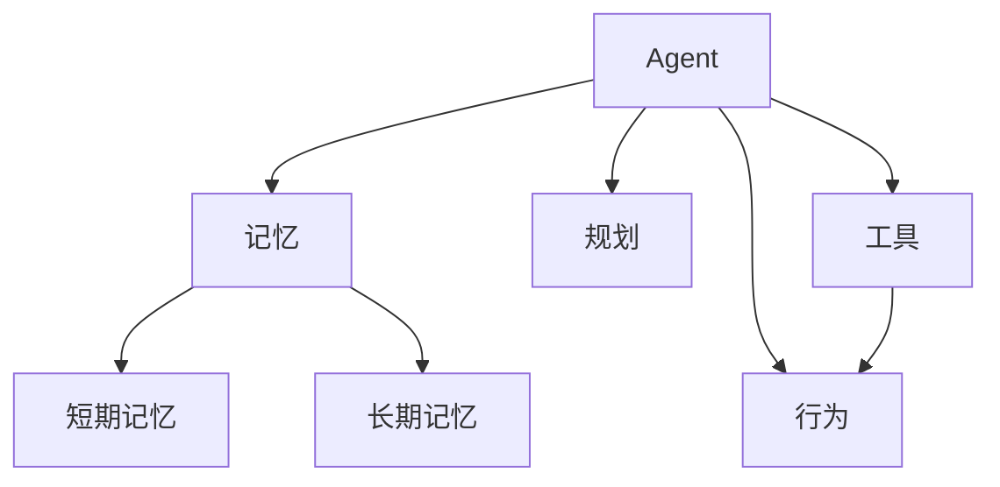

# 人工智能代理

代理: 能自主理解、规划决策和执行复杂任务的智能体

> ReAct（结合推理和行动）

## 实现原理

> Function calling & Assistants API

基于大模型的Agent架构:

- 控制端
  - 自然语言交互
  - 知识
  - 记忆力:
    - 短期记忆：临时存储单次会话周期的上下文信息，受限于模型的上下文窗口长度
    - 长期记忆：可横跨多个会话和时间周期，可通过模型参数微调、知识图谱和向量化数据库等方式实现
  - 推理和规划
    - 子任务拆解（思维链和思维树提示）
    - 反思和改进
  - 迁移性和泛化性

- 感知端
  - 多模态

- 行动端
  - 外部工具

> MCP(Model Context Protocol，模型上下文协议):一种开放协议，旨在实现LLM应用与外部数据源、工具和服务之间的无缝集成
