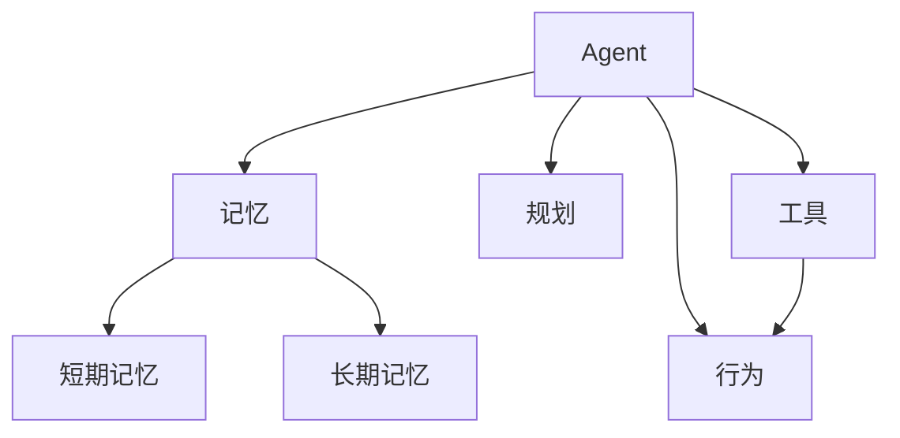

# 人工智能代理

代理: 能自主理解、规划决策和执行复杂任务的智能体

> ReAct

## 实现原理

```mermaid
flowchart 
    Agent --> 记忆
    记忆 --> 短期记忆
    记忆 --> 长期记忆
    Agent --> 规划
    Agent --> 行为
    Agent --> 工具
    工具 --> 行为

```

> Function calling & Assistants API

基于大模型的Agent架构:

- 控制端
  - 自然语言交互
  - 知识
  - 记忆力
  - 推理和规划
  - 迁移性和泛化性

- 感知端
  - 多模态

- 行动端
  - 外部工具

