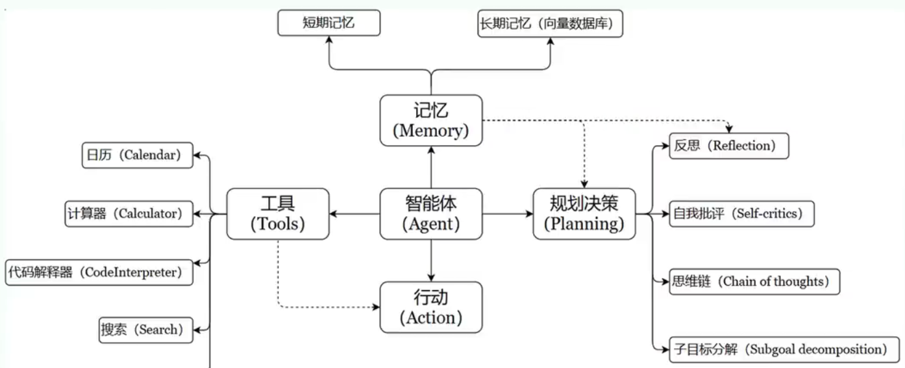
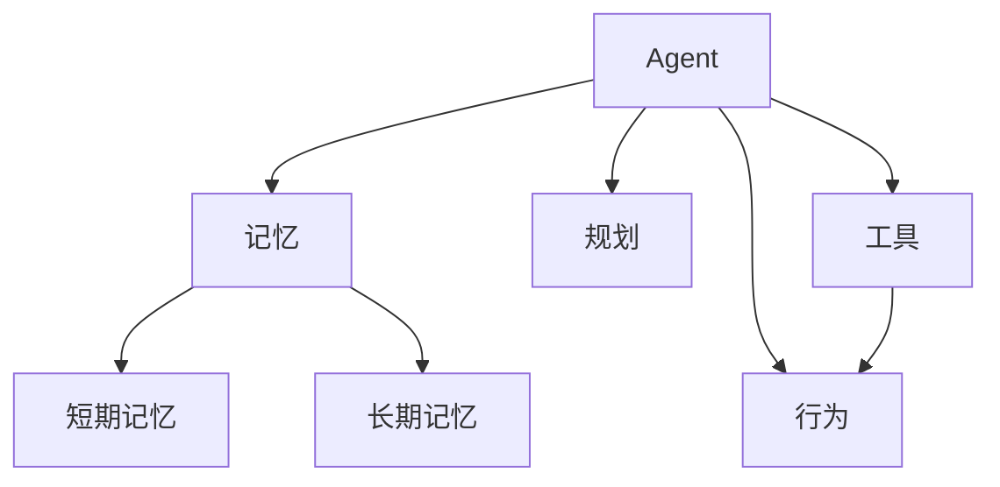
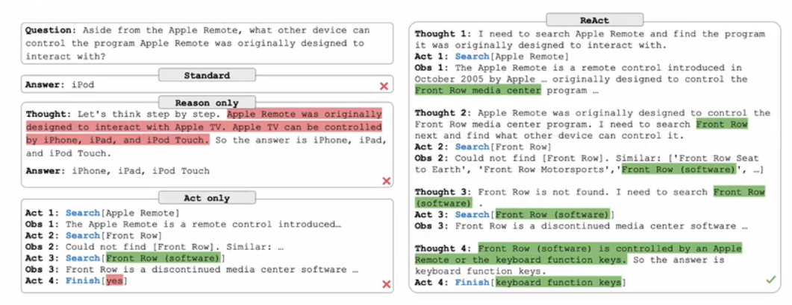
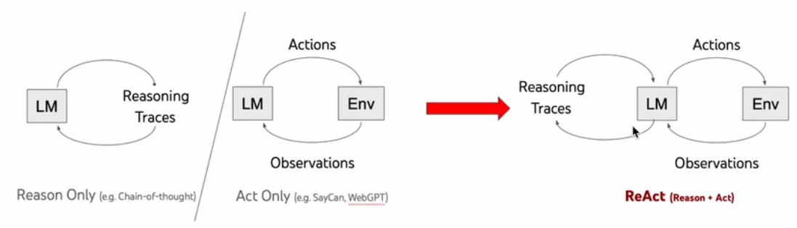

# 人工智能代理

代理: 能自主理解、规划决策和执行复杂任务的智能体

## 实现原理

> Function calling & Assistants API

标准操作流程(Standard Operating Procedure, SOP)

基于大模型的Agent架构:

- 感知端
  - 多模态：语音

- 控制端
  - 自然语言交互、固有知识和推理
  - 记忆:
    - 形成记忆: 模型参数微调
    - 短期记忆：临时存储单次会话周期的上下文信息，受限于模型的上下文窗口长度
    - 长期记忆：可横跨多个会话和时间周期，可通过知识图谱和向量化数据库（外部知识库）等方式实现
  - 规划
    - 子任务拆解（思维链、自洽性和思维树提示）
    - 反思和改进
  - 迁移性和泛化性

- 行动和观察
  - 外部工具说明书

Agent框架:

- Plan and Execute
- Self Ask
- ReAct（结合推理和行动）

> MCP(Model Context Protocol，模型上下文协议):一种开放协议，旨在实现LLM应用与外部数据源、工具和服务之间的无缝集成

工作流:为完成某项任务或业务流程而设计的一系列自动化步骤的有序组合
