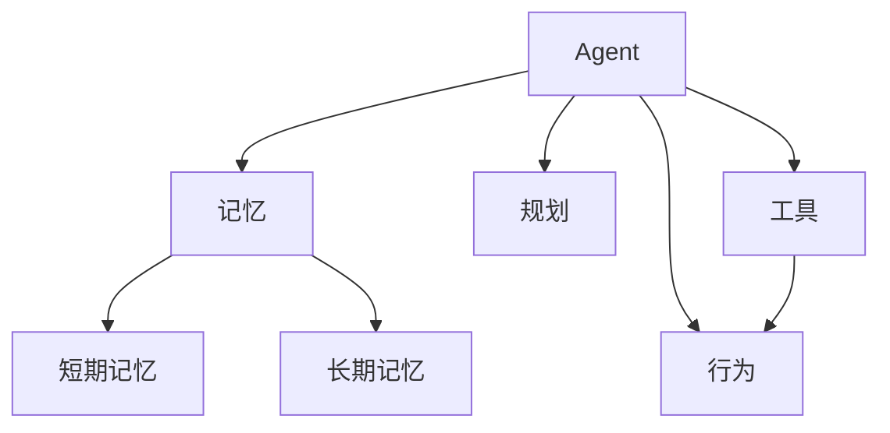

# 人工智能代理

## 实现原理

```mermaid
flowchart 
    Agent --> 记忆
    记忆 --> 短期记忆
    记忆 --> 长期记忆
    Agent --> 规划
    Agent --> 行为
    Agent --> 工具
    工具 --> 行为

```

> Function calling & Assistants API

