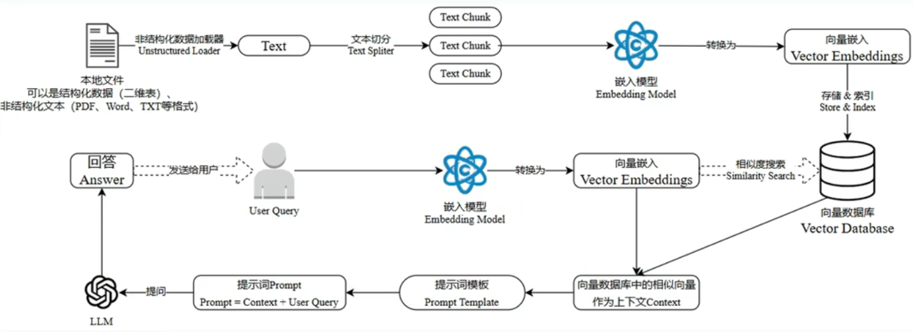

# 检索增强生成

相关概念:

- 检索(Retrieval)：根据用户请求从外部知识源检索相关上下文
- 增强(Augmented)：用户查询和检索到的附加上下文填充至prompt
- 生成(Generation)：检索增强提示输入至LLM生成请求响应

构建数据索引: 文档切分、词嵌入和文本向量化存储

检索方式:

- 关键字检索
- 语义检索

> 语义相似度检索

嵌入模型（Embedding Model）和向量数据库（Vector Database）

Embedding模型:

- `text-embedding-ada-002`
- `Word2Vec`
- `FastText`

向量数据库:

- [Faiss]
- [Chroma]
- [Milvus]
